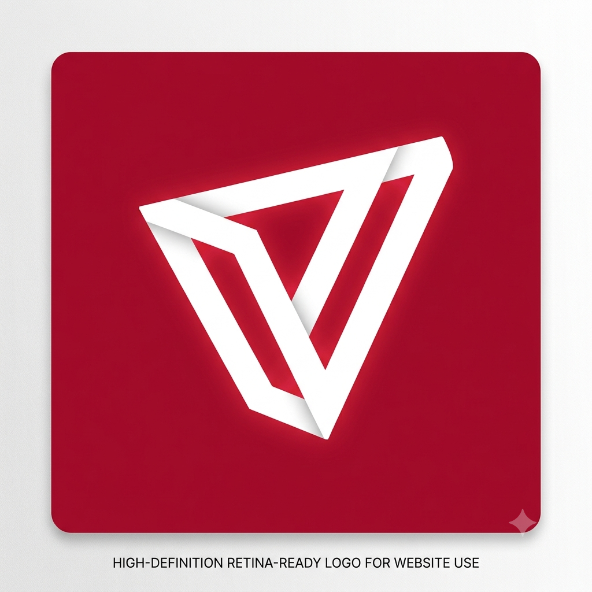
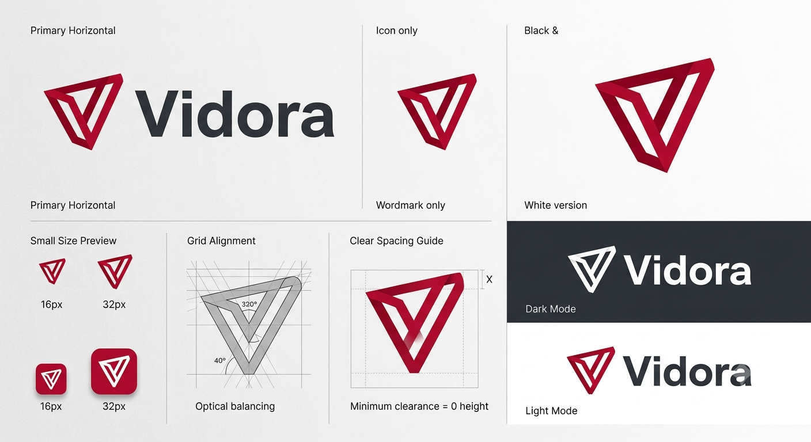

<div align="center">

# 🎬 Vidora

### A modern, premium full-stack video streaming platform

Built with the **MERN stack**, Vidora is a production-quality video platform featuring JWT authentication, Cloudinary-backed uploads & streaming, comments, likes, playlists, subscriptions, channel analytics, watch history, and a polished, theme-aware React interface.

[](LICENSE) [](https://react.dev) [](https://nodejs.org) [](https://expressjs.com) [](https://www.mongodb.com) [](https://tailwindcss.com) [](https://github.com/SaimRaza885/Vidora/pulls)

[Features](#✨-features) · [Tech Stack](#🛠-tech-stack) · [Architecture](#🏗-architecture) · [Screenshots](#📸-screenshots) · [Getting Started](#🚀-getting-started) · [API Reference](#📡-api-reference) · [Frontend Routes](#🗺-frontend-routes) · [Project Structure](#📁-project-structure) · [Scripts](#🧰-scripts--tooling) · [Deployment](#☁️-deployment) · [Contributing](#🤝-contributing) · [Roadmap](#🗺-roadmap) · [FAQ](#❓-faq) · [License](#📜-license)

</div>


---

## 📸 Screenshots

| Concept / Landing | Home Feed | Media & Design |
|---|---|---|
|  |  |  |

*A visual preview of the platform's premium, theme-aware interface.*

## ✨ Features

### Backend (Express REST API)

- ✅ JWT-based authentication (access + refresh tokens) with `bcrypt` password hashing
- ✅ Registration with avatar & cover-image upload via **Cloudinary**
- ✅ Video publishing with simultaneous **video + thumbnail** upload
- ✅ Video streaming with automatic **view-count tracking**
- ✅ CRUD for videos, comments, and playlists
- ✅ Like/unlike for videos and comments
- ✅ Channel **subscribe / unsubscribe** system
- ✅ Channel **dashboard & analytics** (views, subscribers, videos)
- ✅ Watch **history** (per user)
- ✅ Paginated, filterable, sortable video listing with optional auth
- ✅ Centralized error handling + mongoose **aggregation pipelines**
- ✅ CORS, cookie-parser, and environment-driven configuration

### Frontend (React SPA)
- ✅ Brand-new premium UI with **light & dark theme** support
- ✅ Responsive layout for desktop, tablet, and mobile
- ✅ Home feed, **featured hero video**, category chips, and video grid
- ✅ Full **video player** with ads placeholder, controls, and channel card
- ✅ Video **upload** flow with drag-and-drop media dropzones
- ✅ Search, watch history, subscriptions, playlists, and liked videos
- ✅ Channel pages with profile, tabs, and analytics dashboard
- ✅ Pricing, contact, and settings pages
- ✅ Toast notifications, skeleton loaders, and empty/error states
- ✅ **Framer Motion** animations throughout
- ✅ Zero hardcoded colors — fully **semantic design tokens** (theme-aware)

---

## 🛠 Tech Stack

| Technology | Purpose |
|---|---|
| **Node.js** | JavaScript runtime |
| **Express.js** | Web framework & REST API |
| **MongoDB + Mongoose** | Database & Object Data Modeling |
| **Cloudinary** | Media (video/image) storage & delivery |
| **JSON Web Tokens** | Authentication & refresh tokens |
| **bcrypt** | Password hashing |
| **Multer** | Multipart file-upload handling |
| **mongoose-aggregate-paginate-v2** | Aggregation pagination |

### Frontend

| Technology | Purpose |
|---|---|
| **React 19** | UI framework |
| **Vite** | Build tool & dev server |
| **React Router v6** | Client-side routing |
| **Tailwind CSS 4** | Utility-first styling & design tokens |
| **Framer Motion** | Animations & transitions |
| **Axios** | HTTP client |
| **React Context API** | State management |
| **Lucide React** | Icon library |

---

## 🏗 Architecture

Vidora is a **monorepo** with two independent applications that communicate over a REST API.

```
┌──────────────────────────────────────────────────────────────┐
│                         Frontend (React)                      │
│                        http://localhost:5173                  │
│                                                               │
│  ┌──────────┐   ┌──────────┐   ┌───────────┐   ┌──────────┐  │
│  │  Pages   │──▶│  Context │──▶│  Services │──▶│  Axios   │  │
│  │ (store)  │   │   (Auth) │   │ (API)     │   │   client │  │
│  └──────────┘   └──────────┘   └───────────┘   └──────────┘  │
│                                   │                           │
└───────────────────────────────────│───────────────────────────┘
                                    │  /api/v1  (JSON + cookies)
┌───────────────────────────────────│───────────────────────────┐
│                                   ▼                           │
│                        Backend (Express)                      │
│                        http://localhost:8000                  │
│                                                               │
│  ┌───────────┐   ┌───────────┐   ┌─────────┐   ┌──────────┐  │
│  │ Routes    │→ │ Middleware │ → │Controllers│ →│  Models  │  │
│  │ (REST)    │   │ (Auth/Multer)│  │ (logic)   │  │ (Mongoose)││
│  └───────────┘   └───────────┘   └─────────┘   └──────────┘  │
│                                                               │
│            ┌──────────┐       ┌────────────┐                  │
│            │ MongoDB  │       │ Cloudinary │                  │
│            └──────────┘       └────────────┘                  │
└──────────────────────────────────────────────────────────────┘
```

```
Youtube_Backend/
├── backend/          # Express REST API  (port 8000)
├── frontend/         # React + Vite      (port 5173)
├── media/            # Design assets / screenshots
└── README.md
```

---

## 🚀 Getting Started

### Prerequisites

- **Node.js** v18 or higher
- **MongoDB** — local install or an [Atlas](https://www.mongodb.com/atlas/database) connection string
- **Cloudinary** account for video thumbnail / image uploads

### 1. Clone the repository

```bash
git clone https://github.com/SaimRaza885/Vidora.git
cd Youtube_Backend
```

### 2. Backend setup

```bash
cd backend
npm install
```

Create a `.env` file in `backend/` (copy from `.env.example`):

```env
PORT=8000
MONGODB_URI=mongodb+srv://<username>:<password>@cluster0.xxxxx.mongodb.net

CORS_ORIGIN=http://localhost:5173

JWT_ACCESS_TOKEN_SECRET=your_access_token_secret_here
JWT_ACCESS_TOKEN_EXPIRY=1d
JWT_REFRESH_TOKEN_SECRET=your_refresh_token_secret_here
JWT_REFRESH_TOKEN_EXPIRY=7d

CLOUDINARY_CLOUD_NAME=your_cloudinary_cloud_name
CLOUDINARY_API_KEY=your_cloudinary_api_key
CLOUDINARY_API_SECRET=your_cloudinary_api_secret
```

Start the API:

```bash
npm run dev
```

The REST API is now available at **`http://localhost:8000`** (`GET /healthcheck` to verify), and the backend will connect to MongoDB automatically after startup.

### 3. Frontend setup

```bash
cd frontend
npm install
```

Create a `.env.local` file in `frontend/`:

```env
VITE_API_BASE_URL=http://localhost:8000/api/v1
VITE_API_TIMEOUT=10000
```

Start the dev server:

```bash
npm run dev
```

Open **`http://localhost:5173`** in your browser.

> **Tip:** Register a new account (or log in) through the UI — uploads, submissions, playlists, and the dashboard require an authenticated user.

---

## 📡 API Reference

All endpoints are prefixed with **`/api/v1`** unless noted. `JWT` requires an **`Authorization: Bearer <token>`** header (or HTTP-only cookie set on login).

### Health

| Method | Endpoint | Auth | Description |
|---|---|---|---|
| GET | `/healthcheck` | No | Health status probe |

### Users

| Method | Endpoint | Auth | Description |
|---|---|---|---|
| POST | `/users/register` | No | Register a new user (avatar + cover upload) |
| POST | `/users/login` | No | Login with credentials |
| POST | `/users/logout` | JWT | Log out (clears cookie) |
| POST | `/users/refresh-token` | No | Generate new access tokens |
| POST | `/users/change-password` | JWT | Change account password |
| GET | `/users/current-user` | JWT | Get the authenticated user |
| POST | `/users/update-account` | JWT | Update account details |
| PATCH | `/users/change-avatar` | JWT | Update avatar image |
| PATCH | `/users/change-cover-image` | JWT | Update cover image |
| GET | `/users/c/:username` | No | Get a channel profile by username |
| GET | `/users/history` | JWT | Get the user's watch history |

### Videos

| Method | Endpoint | Auth | Description |
|---|---|---|---|
| GET | `/videos` | Optional | List videos (paginated, filterable/sortable) |
| POST | `/videos` | JWT | Publish a video (videoFile + thumbnail upload) |
| GET | `/videos/:videoId` | Optional | Get a single video's details |
| PATCH | `/videos/:videoId` | JWT | Update video metadata (+ thumbnail) |
| DELETE | `/videos/:videoId` | JWT | Delete a video (owner only) |
| PATCH | `/videos/toggle/publish/:videoId` | JWT | Toggle publish / draft status |
| PATCH | `/videos/views/:videoId` | No | Increment the view count |

### Comments

| Method | Endpoint | Auth | Description |
|---|---|---|---|
| GET | `/comments/:videoId` | No | Get comments for a video |
| POST | `/comments/:videoId` | JWT | Add a comment |
| PATCH | `/comments/c/:commentId` | JWT | Update a comment (owner) |
| DELETE | `/comments/c/:commentId` | JWT | Delete a comment (owner) |

### Likes

| Method | Endpoint | Auth | Description |
|---|---|---|---|
| POST | `/likes/toggle/v/:videoId` | JWT | Like / unlike a video |
| POST | `/likes/toggle/c/:commentId` | JWT | Like / unlike a comment |
| GET | `/likes/videos` | JWT | Get the user's liked videos |

### Playlists

| Method | Endpoint | Auth | Description |
|---|---|---|---|
| POST | `/playlist` | JWT | Create a playlist |
| GET | `/playlist/user/:userId` | No | Get a user's playlists |
| GET | `/playlist/:playlistId` | Optional | Get a playlist by ID |
| PATCH | `/playlist/:playlistId` | JWT | Update a playlist (owner) |
| DELETE | `/playlist/:playlistId` | JWT | Delete a playlist (owner) |
| PATCH | `/playlist/add/:videoId/:playlistId` | JWT | Add a video to a playlist |
| PATCH | `/playlist/remove/:videoId/:playlistId` | JWT | Remove a video from a playlist |

### Subscriptions

| Method | Endpoint | Auth | Description |
|---|---|---|---|
| GET | `/subscriptions/c/:channelId` | JWT | Get a channel's subscribers |
| POST | `/subscriptions/c/:channelId` | JWT | Subscribe / unsubscribe to a channel |
| GET | `/subscriptions/u/:subscriberId` | JWT | Get channels the user subscribed to |

### Dashboard

| Method | Endpoint | Auth | Description |
|---|---|---|---|
| GET | `/dashboard/stats` | JWT | Channel statistics (views, subscribers, etc.) |
| GET | `/dashboard/videos` | JWT | The channel owner's videos |

---

## 🗺 Frontend Routes

| Path | Page | Auth Required |
|---|---|---|
| `/` | Landing / Home (video grid + featured hero) | Optional (guest mode) |
| `/login` | Sign in | No |
| `/register` | Create account | No |
| `/video/:videoId` | Video player | No |
| `/video/edit/:videoId` | Edit video | Yes |
| `/channel/:username` | Channel page | No |
| `/search` | Search results | No |
| `/upload` | Upload video | Yes |
| `/playlists` | My playlists | Yes |
| `/playlists/:id` | Playlist detail | Yes |
| `/liked-vidoes` | Liked videos | Yes |
| `/profile` | Profile & settings | Yes |
| `/subscriptions` | Subscriptions | Yes |
| `/history` | Watch history | Yes |
| `/pricing` | Pricing | No |
| `/contact` | Contact | No |

---

## 📁 Project Structure

```
Youtube_Backend/
├── backend/                         # Express REST API
│   ├── src/
│   │   ├── controllers/             # Request handlers / business logic
│   │   │   ├── user.controllers.js
│   │   │   ├── video.controllers.js
│   │   │   ├── comment.controllers.js
│   │   │   ├── like.controllers.js
│   │   │   ├── playlist.controllers.js
│   │   │   ├── subscription.controllers.js
│   │   │   ├── dashboard.controllers.js
│   │   │   └── healthcheck.controllers.js
│   │   ├── db/index.js               # MongoDB connection
│   │   ├── middleware/
│   │   │   ├── auth.middleware.js    # JWT verification
│   │   │   ├── optionalAuth.middleware.js
│   │   │   └── multer.middleware.js  # File upload
│   │   ├── models/                   # Mongoose schemas
│   │   │   ├── user.model.js
│   │   │   ├── video.model.js
│   │   │   ├── comment.model.js
│   │   │   ├── like.model.js
│   │   │   ├── playlist.model.js
│   │   │   └── subscription.model.js
│   │   ├── routes/                   # Express route definitions
│   │   ├── utils/                    # API error handler etc.
│   │   ├── app.js                    # Express app configuration
│   │   └── index.js                  # Server entry point
│   ├── .env.example
│   └── package.json
│
├── frontend/                         # React + Vite SPA
│   ├── public/
│   │   └── logo.png
│   ├── src/
│   │   ├── components/               # Reusable UI components
│   │   │   ├── ui/                   # Button, Input, Modal, Skeleton…
│   │   │   ├── layout/               # Navbar, Sidebar…
│   │   │   ├── video/                # VideoCard, VideoGrid…
│   │   │   ├── comments/
│   │   │   ├── channel/
│   │   │   ├── playlist/
│   │   │   ├── upload/
│   │   │   └── common/
│   │   ├── context/                  # Auth, UI contexts
│   │   ├── hooks/
│   │   ├── pages/                    # Route page components
│   │   ├── services/                 # Axios API client
│   │   ├── styles/globals.css        # Tailwind + design tokens
│   │   ├── utils/
│   │   ├── App.jsx                   # Root app with routing
│   │   └── main.jsx                  # Entry point
│   ├── .env.example
│   └── package.json
│
├── media/                            # Design assets & screenshots
└── README.md
```

---

## 🧰 Scripts & Tooling

### Backend (`cd backend`)

| Script | Command | Description |
|---|---|---|
| `dev` | `nodemon src/index.js` | Start the API with auto-reload |

### Frontend (`cd frontend`)

| Script | Command | Description |
|---|---|---|
| `dev` | `vite` | Start the Vite dev server |
| `build` | `vite build` | Build for production (`dist/`) |
| `preview` | `vite preview` | Preview the production build |
| `lint` | `eslint src` | Run ESLint |

---

## ☁️ Deployment

### Backend

Deploy the `backend/` directory to any Node.js host:

- **Render** — Web Service
- **Railway**
- **Heroku**
- **VPS** — DigitalOcean, AWS EC2, etc.

Ensure all environment variables are configured on the host (a `.env` is **not** committed).

### Frontend

Deploy the `frontend/` directory to a static host:

- **Vercel** (recommended)
- **Netlify**

**Build command:** `npm run build` (outputs to `dist/`). Set `VITE_API_BASE_URL` to your deployed backend URL before building.

---

## 🤝 Contributing

Contributions are welcome! The repo aims to be welcoming to first-time and experienced contributors alike:

1. **Fork** the repository
2. Create a feature branch (`git checkout -b feature/amazing-feature`)
3. Commit your changes (`git commit -m 'feat: add amazing feature'`)
4. Push to the branch (`git push origin feature/amazing-feature`)
5. Open a **Pull Request**

Please keep changes focused, follow the existing code style, and ensure the build (`npm run build`) passes.

---

## 🗺 Roadmap

- [ ] Server-side rendering / hydration for better SEO
- [ ] Live streaming support (HLS / WebRTC)
- [ ] Notifications (email + in-app push)
- [ ] Public channel analytics endpoints
- [ ] End-to-end testing suite (Playwright)
- [ ] i18n / multilingual support
- [ ] PWA offline support

---

## ❓ FAQ

**The frontend can't reach the API — I see CORS errors.**
Verify the backend `CORS_ORIGIN` equals the exact frontend origin you open (`http://localhost:5173`) and that credentials are enabled.

**Port 5000 vs port 8000?**
The backend listens on the port in your `backend/.env` (`PORT=8000`). Make sure `VITE_API_BASE_URL` in the frontend points to `http://localhost:8000/api/v1`.

**Uploads fail.**
Check your `CLOUDINARY_CLOUD_NAME`, `CLOUDINARY_API_KEY`, and `CLOUDINARY_API_SECRET` and confirm your plan allows the file sizes you upload.

**Can I see it live before signing up?**
Yes — the home page supports **guest mode** so you can browse videos and channels without an account.

---

## 📜 License

This project is **open source** and licensed under the **MIT License** — see the [LICENSE](LICENSE) file for details.

---

## 🙏 Acknowledgements

- [Cloudinary](https://cloudinary.com) for cloud media storage
- [Lucide](https://lucide.dev) for the icon set
- [Framer Motion](https://www.framer.com/motion/) for animations
- The open-source Node.js, Express, MongoDB & React ecosystems

---

## 👤 Author

**Saim Raza**

Project repository: [https://github.com/SaimRaza885/Vidora](https://github.com/SaimRaza885/Vidora)

<div align="center">

Made with ❤️ — happy streaming with **Vidora**!

</div>
